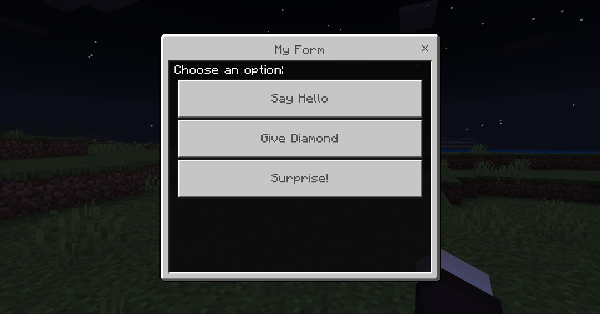

# MyFormPlugin

[](.#)
[](https://pmmp.io/)
[](https://github.com/jojoe77777/FormAPI)
[](./LICENSE)

MyFormPlugin is a PocketMine-MP plugin that displays a dynamic form to players using the `/myform` command. The form buttons, messages, and commands are fully configurable via `config.yml`.

- - -

## ✨ Screenshot

### Command (In-Game)


### Form Preview



- - -

## ✨ Features

* Dynamic form driven entirely by `config.yml`
* Customizable title, content, and buttons
* Buttons can:
  * Send a message to the player
  * Execute a command as either **player** or **console**
* Supports placeholders (`%player%`) for player names
* Easy to extend and modify without touching PHP code

- - -

## 📂 Installation

1. Download or build the plugin `.phar`.
2. Place it in your PocketMine `plugins/` folder.
3. **Install the required dependency [FormAPI](https://github.com/jojoe77777/FormAPI)** by placing its `.phar` in the same `plugins/` folder.
4. Restart your server.
5. Edit the generated `config.yml` in `plugins/MyFormPlugin/` to customize your form.

- - -

## ⚙️ Configuration (`config.yml`)

The plugin uses a YAML configuration file (`config.yml`) located in the plugin's data folder (`plugins/MyFormPlugin/config.yml`).

### Example

```yaml
title: "My Form"
content: "Choose an option:"
buttons:
  - text: "Say Hello"
    message: "Hello, %player%!"
    run_as: "player"

  - text: "Give Diamond"
    message: "You received a diamond!"
    command: "give %player% diamond 1"
    run_as: "console"

  - text: "Surprise!"
    message: "You found a secret button!"
    run_as: "player"
```

- - -

## 🔑 Config Syntax Explained

* **`title`** → Title of the form window (string, required).

* **`content`** → Text displayed above the buttons (string, required).

* **`buttons`** → List of button definitions (array, required).

Each button supports:

* **`text`** → Label shown on the button (string, required).

* **`message`** → Message sent to the player when clicked (string, optional). Supports `%player%`.

* **`command`** → Command executed when clicked (string, optional). Supports `%player%`.

* **`run_as`** → `"player"` or `"console"` (string, optional, defaults to `"player"`).

### 🧩 Placeholders

* `%player%` → replaced with the player's in‑game name.

- - -

## 📜 Commands

The plugin registers the following commands in [`plugin.yml`](https://plugin.yml):

```yaml
commands:
  myform:
    description: Displays a dynamic form
    usage: /myform
    permission: myformplugin.command.myform

  myformreload:
    description: Reloads the form config
    usage: /myformreload
    permission: myformplugin.command.reload
```

- - -

## 🔒 Permissions

```yaml
permissions:
  myformplugin.command.myform:
    description: Allows usage of /myform
    default: true

  myformplugin.command.reload:
    description: Allows reloading of config
    default: op
```

- - -

## 📦 Dependencies

MyFormPlugin requires the following:

* **PocketMine-MP**\\ Version: 5.x (tested on API 5.0.0)

* **FormAPI** by jojoe77777\\ Provides the `SimpleForm` class used to build interactive forms.\\ Download from: [FormAPI GitHub Releases](https://github.com/jojoe77777/FormAPI/releases)\\ Place [`FormAPI.phar`](https://FormAPI.phar) in your `plugins/` folder alongside MyFormPlugin.

- - -

## 📜 License

This project is licensed under the MIT License.
